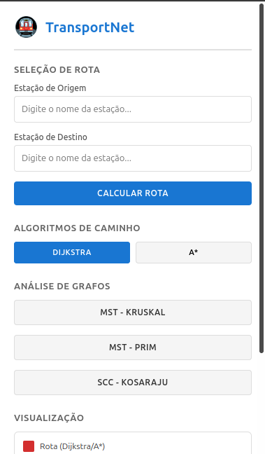
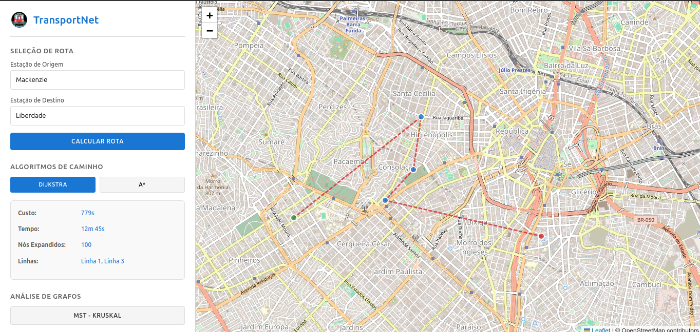
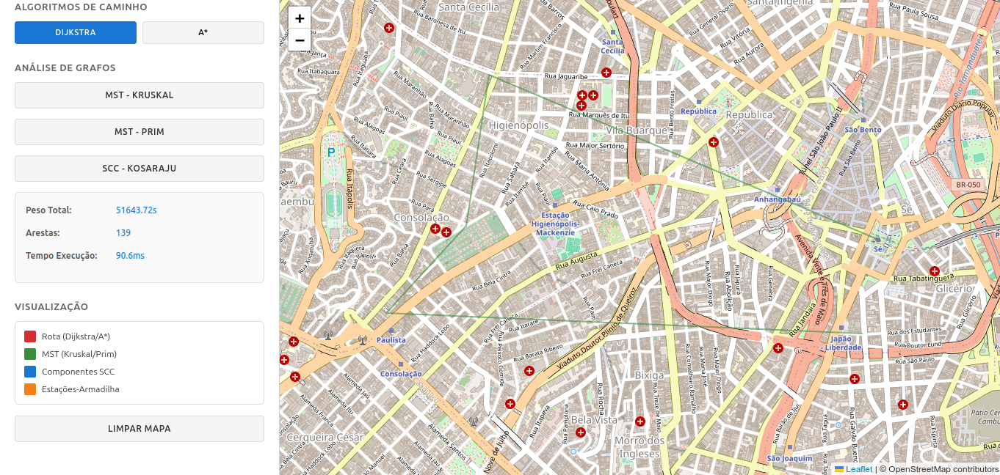

# G28_Grafos_PA-26.2

# Rede de Metrôs de SP

##Alunos

|Matrícula | Aluno |
| -- | -- |
| 231026302  |  Caio Lucas Messias Sabino |
| 231027201  |  João Igor Pereira da Costa |

# TransportNet - Sistema de Roteirização do Metrô

> Simulação e análise da malha metroviária utilizando estruturas de grafos e algoritmos clássicos de otimização.

---

## Sobre o Projeto

O **TransportNet** é uma aplicação desenvolvida para simular o funcionamento e a gestão de uma rede de transporte metroviário no Distrito Federal. O objetivo principal é aplicar e demonstrar o uso prático de **5 algoritmos de grafos** fundamentais estudados no primeiro módulo da disciplina:

1. **Dijkstra** — Encontramento do caminho mínimo (menor rota/tempo) entre duas estações.
2. **A\* (A-Star)** — Busca de rota otimizada utilizando heurísticas espaciais.
3. **Kruskal (MST)** — Algoritmo de árvore geradora mínima para conexões de rede de menor custo estrutural.
4. **Prim (MST)** — Alternativa para árvore geradora mínima focada em eficiência de expansão a partir de nós iniciais.
5. **Kosaraju (SCC)** — Identificação de componentes fortemente conexos para análise de conectividade e resiliência da rede.

---

## Screenshots

*(Adicione aqui pelo menos 3 capturas de tela do projeto em funcionamento)*

| Tela Inicial / Seleção de Rota | Visualização do Caminho Mínimo (Dijkstra/A*) | Análise de Grafos (MST / SCC) |
| :---: | :---: | :---: |
|  |  |  |

---

## Pré-requisitos e Instalação

Certifique-se de ter o ambiente configurado com as ferramentas necessárias:

* **Linguagem:** Java (versão 17 ou superior recomendada)

### Passos para clonar e rodar:

```bash
# Clone este repositório
git clone [https://github.com/seu-usuario/TransportNet.git](https://github.com/seu-usuario/TransportNet.git)

# Entre na pasta do projeto
cd TransportNet

# Ligue o Live Server(extensão do VS Code)
